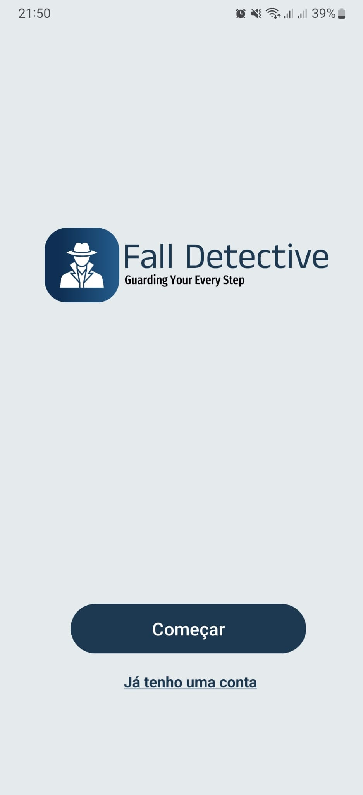
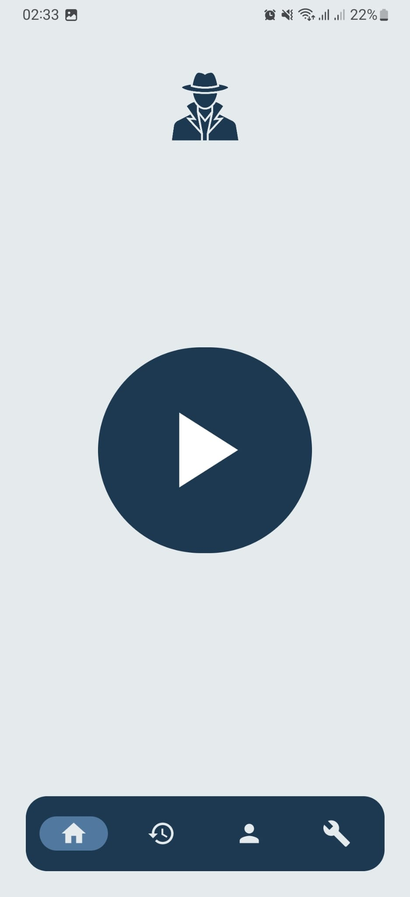
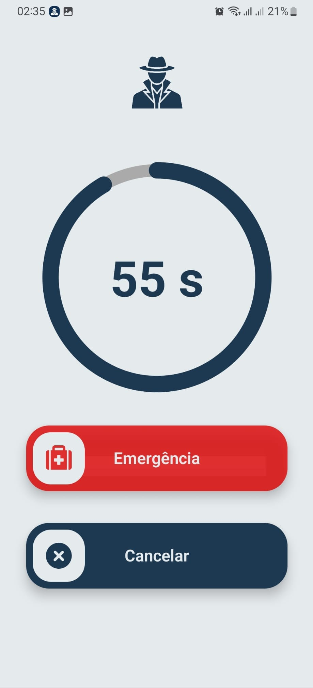
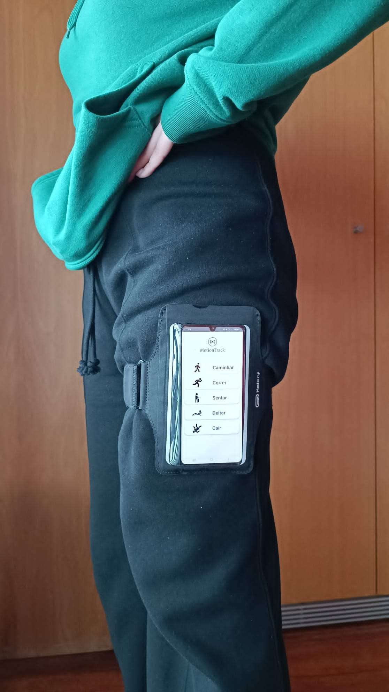
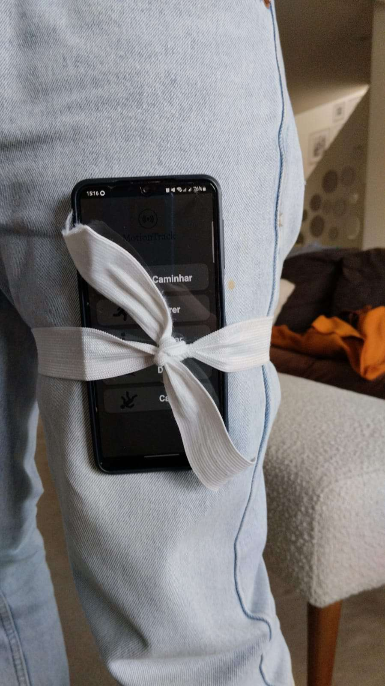
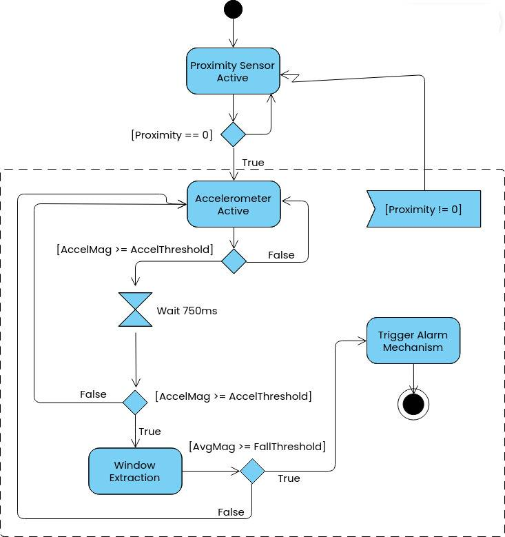

# FallDetective

Android application for fall detection runnins using the smartphone-integrated accelerometer. The app runs a background service for continuous monitoring, triggers an audible/visual alarm upon detecting a potential fall, and automatically sends SMS alerts with location to emergency contacts if the alarm is confirmed or not canceled within 60 seconds.

  
  
  

### Key Features

- **Continuous Monitoring**: Background service using the accelerometer and proximity sensor.
- **Proximity Sensor Control**: Activates monitoring only when the phone is likely in a pocket.
- **Fall Alarm**: Full-screen alarm with 1-minute countdown, works over lock screen.
- **Emergency Alert**: Sends SMS with GPS location to predefined contacts if no user response or fall is confirmed.
- **User Configuration**: Authentication, emergency contacts setup, monitoring toggle.
- **Fall History**: Logs detected alarms for review.

### Data Collection

#### Methodology

- Phone placed in a position simulating a pants pocket.
- Data collected from volunteers of different age groups.
- Varied surfaces (hard/soft) and locations for diversity.
- Activities recorded: Falling, Sitting, Lying down, Walking.

Image: Illustration of the experimental procedure

  
  

#### Dataset

Tota: **72 records**

| Activity | Records |
|----------|----------|
| Fall | 22 |
| Sit | 29 |
| Lie Down | 14 |
| Walk | 7 |

### Continous Monitoring and Fall Detection Algorithm

The detection uses a threshold-based algorithm on accelerometer data: monitor magnitude for sudden peaks (impact) followed by low activity (immobility).

Image: Activity diagram for the developed algorithm

 

### Performance

Tested on collected dataset:

- Accuracy: **81.9%**
- Falls correctly detected: **21/22**
- False positives: **Walking** activity very prone to FPs

### Limitations

- Threshold-based algorithm prone to false positives.
- Reliability of the proximity sensor reliability.
- No universal support for all Android versions/devices.

### Future Improvements

- Expand to weareble integration.
- Improve battery efficiency and cross-device compatibility.

### Project Context

This project was developed in an academic setting as part of the Master's in Software Engineering, specializing in Intelligent Systems.
